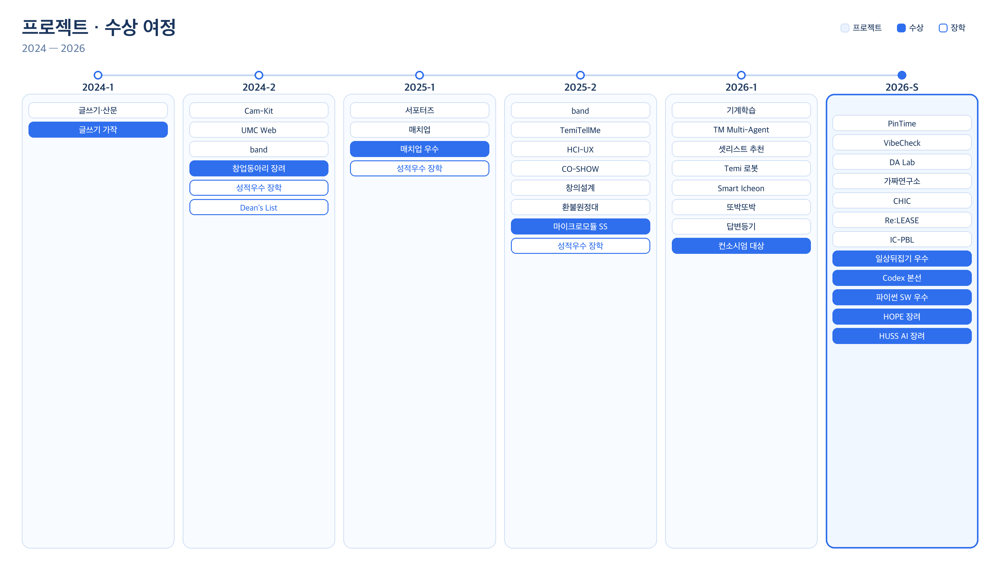

# 이지우 | Lee Jiwoo

> **AI가 답을 던지는 시대에, ‘왜?’를 묻는 개발자**

광운대학교 정보융합학부 비주얼테크놀로지전공 · 2024.03 ~  
GPA **4.32 / 4.50** · Major **4.50 / 4.50**

[dlwldn4824@naver.com](mailto:dlwldn4824@naver.com) · [성장 기록 @due_study_archive](https://www.instagram.com/due_study_archive/)

  

## 소개

처음부터 공부를 잘했던 사람은 아닙니다. 대신 **이해할 때까지 해보는 사람**입니다.

모르는 논문이 나오면 한 번 읽고 끝내지 않습니다. 문제 정의부터 실험까지 다시 뜯어서, 남에게 설명할 수 있을 때까지 50~60장 PPT로 재구성합니다. 좋은 성적은 그 습관의 결과였습니다.

프로젝트도 같은 루프입니다. `문제 정의 → 검증 → 구현 → 측정 → 회고`. AI는 만능이 아니라, **잘할 수 있는 자리에만** 둡니다.

## 프로젝트

**[PinTime](https://github.com/dlwldn4824/pintime)** · [열어보기](https://pintime.vercel.app/)  
톡방에서 “언제 돼?”를 다섯 번 주고받다가, 확정되면 캘린더에 또 적던 그거. 자연어로 제약을 말하면 후보가 나오고, 고르면 일정입니다.  
→ 제1회 일상뒤집기 공모전 우수상

**[VibeCheck](https://github.com/dlwldn4824/view_check)** · [열어보기](https://view-check-three.vercel.app/)  
바이브 코딩은 배포를 빨리 해주는데, 배포한 게 안전한지는 안 물어봅니다. 정책으로 실제로 때려보고, 사람이 승인한 뒤 같은 공격을 다시 넣습니다.  
→ [코덱스](https://lnkd.in/p/gYjRgmVu) 커뮤니티 해커톤 본선

**[Smart Icheon Care](https://github.com/dlwldn4824/smart_icheon_care)** · [이천스마트 케어](https://lnkd.in/p/gf6RXq2X)  
넓은 지역을 소수 인력이 전수 순찰할 수는 없습니다. YOLO11s로 찾고, 위험한 것부터 사람이 확정합니다. F1 0.591, 약 15.7 FPS.  
→ 지능형 로봇 컨소시엄 대상 · 파이썬 SW 심화 우수상

**[또박또박](https://github.com/dlwldn4824/HOPE_organization)**  
치료실 밖에서 발음이 맞는지 알려주는 사람이 없습니다. Wav2Vec2-CTC로 음소를 맞춰 PCC/PER로 보여줍니다. 팀장으로 만들었습니다.  
→ 소원 H.O.P.E 장려상 · HUSS AI 장려상

**[답변등기](https://github.com/dlwldn4824/kb_AI_challenge)**  
AI 상담 초안을 전건 사람이 검수하면 지칩니다. AI는 초안과 위험 선별만, 봉인·발송은 SHA256/HMAC. 위험 큐 1,248 → 39.  
→ KB 금융 챌린지 · 합성 Recall@39 81.3%

## 수상

| 시기 | 내용 | 관련 |
| --- | --- | --- |
| 2026.08 | [제1회 일상뒤집기 공모전 우수상](https://github.com/dlwldn4824/pintime) | [PinTime](https://github.com/dlwldn4824/pintime) |
| 2026.08 | [코덱스 커뮤니티 해커톤 본선](https://lnkd.in/p/gYjRgmVu) | [VibeCheck](https://github.com/dlwldn4824/view_check) |
| 2026.08.07 | [파이썬 SW 활용 경진대회 심화 우수상](https://github.com/dlwldn4824/smart_icheon_care) | [이천스마트 케어](https://lnkd.in/p/gf6RXq2X) |
| 2026.07.22 | [소원 H.O.P.E 창의보조공학 경진대회 장려상](https://github.com/dlwldn4824/HOPE_organization) | [또박또박](https://github.com/dlwldn4824/HOPE_organization) |
| 2026.07.01–07.03 | [HUSS AI 경진대회 장려상](https://github.com/dlwldn4824/HOPE_organization) | [또박또박](https://github.com/dlwldn4824/HOPE_organization) · 광운대 대표 |
| 2026.06.24–06.26 | [지능형 로봇 컨소시엄 창의융합캠프 대상](https://github.com/dlwldn4824/smart_icheon_care) | [이천스마트 케어](https://lnkd.in/p/gf6RXq2X) |
| 2025.12 | 마이크로모듈 초급 SS급 | 지능형로봇사업단 |
| 2025.05.29 | 매치업 심화과정 우수상 | 실무보고서 · 포스터 |
| 2024.12 | 창업동아리 경진대회 장려상 | 광운대학교 |
| 2024.05 | 글쓰기 대회 가작 | 산문 |

## 장학

| 시기 | 내용 | 관련 |
| --- | --- | --- |
| 2025.12 | 성적우수 장학금 | 광운대학교 |
| 2025.06 | 성적우수 장학금 | 광운대학교 |
| 2024.12 | Dean's List | 광운대학교 |
| 2024.09 | 성적우수 장학금 | 광운대학교 |

## 이력

- **조민수 교수 랩 [학부연구생](https://dataanalysislab-web.github.io/dalab-site/)** (2026.07 ~)
- **광운대 대학혁신 서포터즈** (2026.06 ~) — 프로그램 홍보와 재학생 지원
- **[가짜연구소](https://pseudo-lab.com/) 13기 빌더**
- **[CHIC](https://github.com/kw-chi-community) 교내 HCI 동아리 운영진**
- **연합 서비스 개발 동아리 [Re:LEASE](https://lnkd.in/p/gbCnQyj2) 1기 회장**
- **[싱잇](https://lnkd.in/p/gBab3DQP)**
- **LG AIMERS 9기** (2026.07 ~ 2026.09.02)
- **iM:POSSIBLE Challenger** 금융 해커톤
- **KB 금융 챌린지** — [답변등기](https://github.com/dlwldn4824/kb_AI_challenge)
- **글로벌 IC-PBL 비교과 프로그램** (2026.08.22–08.25) — [베이징](https://lnkd.in/p/gbVfjetY)에서 휴머노이드·지능형 로봇 현장을 봄
- **공유교과** (2026.08.26–08.28)
- **CHIC 해커톤** (2026.08.13–08.14)
- **KT 희망나눔 랜선나눔캠퍼스 멘토링** — 중학생 대상 AI·데이터 교육 (진행 중)
- **교내 AI 티키타카 멘토** — 전기/전자과 학생들과 AI 프로젝트 (진행 중)
- **교내 이산수학 멘토 · 튜터**
- **성북 청소년센터 협력 프로그램** — 개발 제안 완료
- **HUSS 로컬임팩트 아이디어톤** — 제안서 제출

## 기술

Java · JavaScript · TypeScript · Python · React · Next.js · Node.js · FastAPI
